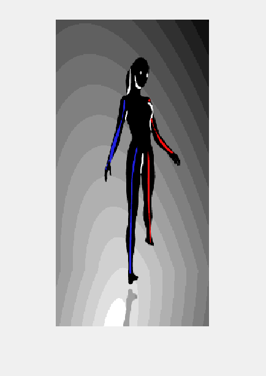
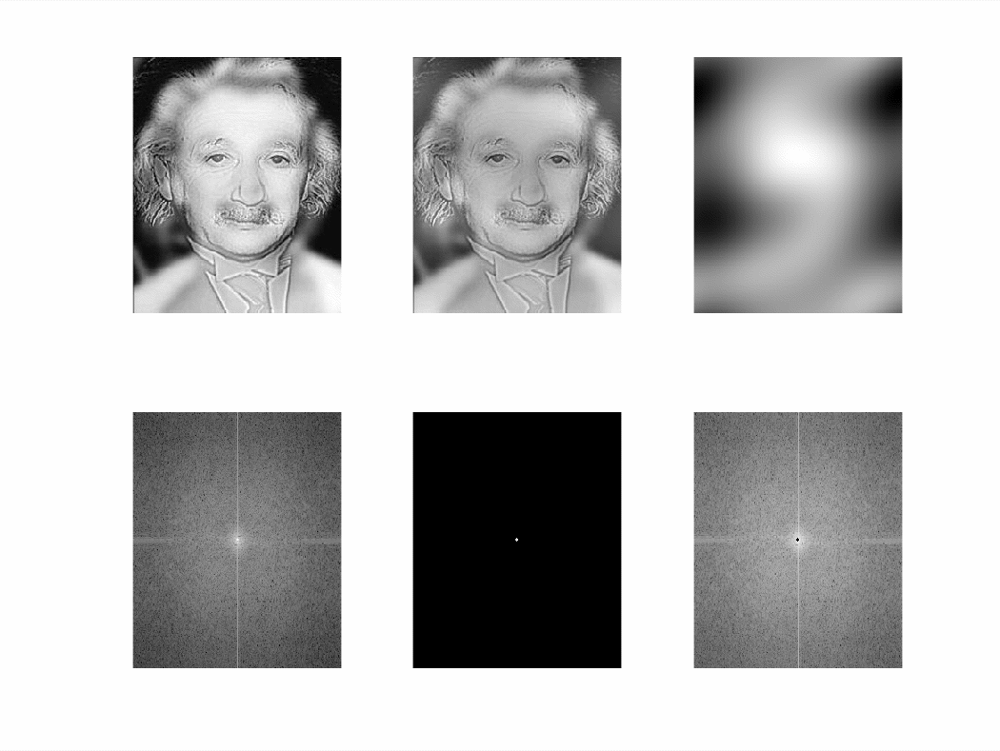
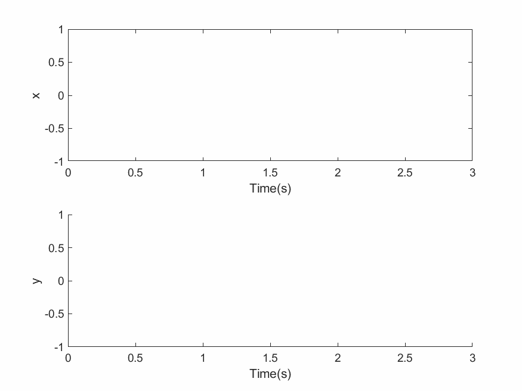
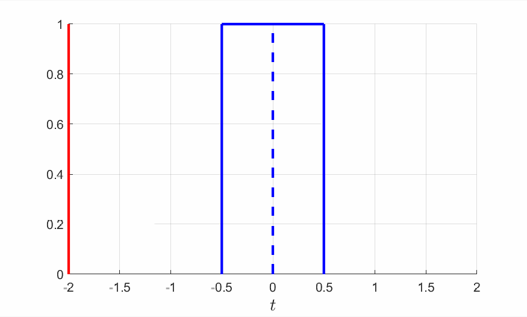

# Animation

MATLAB examples that generate GIF animations for a spinning dancer, Fourier transforms, echoes, and convolution.  
Copyright (C) 2019 Jing Wang

## Spinning Dancer
<table style="width:25%"; table-layout:fixed;>
  <tr>
    <td></td>
  </tr>
</table>

## FFT
<table style="width:25%"; table-layout:fixed;>
  <tr>
    <td></td>
  </tr>
</table>

Ref: An Intuitive Explanation of Fourier Theory http://cns-alumni.bu.edu/~slehar/fourier/fourier.html#filtering 

## Echo
<table style="width:25%"; table-layout:fixed;>
  <tr>
    <td></td>
  </tr>
</table>

Ref: 刘正春, 赵锦成, 王勇, & 王文婷. (2015). 基于matlab的卷积教学仿真设计——回音系统. 实验科学与技术, 13(5), 62-64.

## Convolution
<table style="width:25%"; table-layout:fixed;>
  <tr>
    <td></td>
  </tr>
</table>

## Quick Start

Open the repository in MATLAB and run one of `Dancer_GIF.m`, `FFT_GIF.m`, `Echo_GIF.m`, or `Convolution_GIF.m`. The scripts write the corresponding GIF files in the repository directory. `MultImage2Gif.m` is the shared image-to-GIF helper; `Record_x.wav` and `FFT_sample.jpg` are inputs used by the examples.

## License

See the existing [GNU General Public License, version 3](LICENSE).
